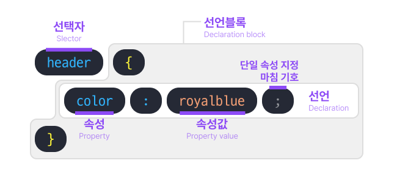
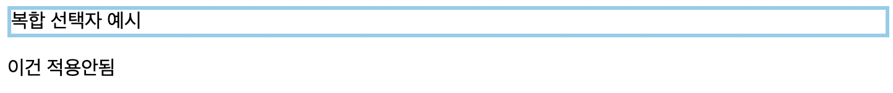
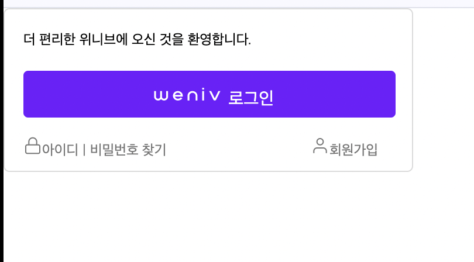

# 🗒️ 표(table)

## table

- 테이블을 생성할 때 사용합니다.
- `<table>`은 테이블 데이터의 컨테이너 요소입니다.

### td / tr / th

- `tr`: table row. 테이블의 행
- `th`: table header. 테이블의 행, 열의 제목을 나타내는 셀
- `td`: table data. 셀 내용

## caption

- 테이블의 제목이나 설명을 나타냅니다.
- 반드시 table 태그의 첫번째 자식으로 사용해야 합니다.
- 선택적인 요소로 필수사항은 아닙니다

## thead / tbody / tfoot

- 모두 필수 조건은 아닙니다.(테이블의 크기가 너무 커서 구획을 나눌 필요가 있다고 판단될 때 사용 하시면 됩니다.)

---

## 속성

### colspan, rowspan

- 셀 병합 속성입니다.
- `colspan`: 열 병합으로 열과 열을 병합 합니다.
- `rowspan`: 행 병합으로 행과 행을 병합 합니다.

---

# 🖼️ CSS

## CSS란?

- css는 **Cascading Style Sheets**의 약자 입니다.
- Cascading
    - CSS에서 스타일이 적용될 때는, 우선순위를 가지고 적용 됩니다. 이 우선 순위가 적용되는 과정이 마치 폭포처럼 위에서 아래로 떨어지는 모양이기 때문에 Cascade 라는 단어가 붙었습니다.
- CSS의 우선순위
    - Extemal CSS(CSS파일) → CSS in```<head>```(```<head>```안에 있는 ```<style></style>```) → inline CSS(```<body> 안에 있는 태그에 붙은 <style>```) → CSS applied by the user(개발자가 아닌 사용자가 브라우저에서 직접 변경 하는 것)
- CSS는 우리가 작성한 HTML의 스타일, 레이아웃 등을 꾸미는 역할을 합니다.
- CSS를 한번 작성하여 여러 HTML에서 재사용 할 수 있습니다.

## 작성방법



- 아래와 같이 작성하면 됩니다.

```css
Selector{
		스타일 속성: 속성 값;
}
```

## 주석

- 한 줄, 여러줄 모두 `/* */` 으로 작성 하면 됩니다.

---

# 🔽 CSS 상속

## 상속(Inheritance)

- CSS에는 상속되는 속성이 있고, 상속되지 않는 속성이 있습니다.
- `width`, `heigh`, `margin`, `padding`, `border` 와 같은 것은 기본적으로 상속되지 않습니다.
  (layout에 영향을 줄 수 있는 속성은 상속되지 않습니다)
- `inherit`: 선택한 요소에 적용된 속성 값을 상속받게 합니다.
- `initial`: 브라우저 기본 스타일 속성을 따르게 합니다.
- `button`, `input` 요소처럼 form 관련 태그들은 상속받지 않기도 합니다.
  (각 브라우저, os에 따라서 적용된 스타일이 있기 때문)

---

# 🎨 CSS 선택자

## 전체 선택자(`*`)

- universal selector
- `html` 을 포함한 HTML 문서 내의 모든 요소를 선택 합니다. `*` 를 사용하여 선택할 수 있습니다.
- 예시

```css
* {
	margin: 0;
	padding: 0;
}

```

## 타입(유형) 선택자 (태그, 요소 선택자)

- type selector
- 특정 태그를 선택합니다.(제목태그, 메인태그등등)
- 예시

```css
h1 {
	font-weight:bold;
}
p{
	font-size: 24px;
}
```

## id 선택자(`#`)

- id selector
- **HTML 페이지 내에 id는 유일해야 합니다**.**(동일한 id를 여러번 사용할 수 없습니다)**
- HTML 안에서 한번만 사용되기 때문에 재사용성이 떨어집니다.
- 아이디 속성은 주로 JavaScript 또는 해시 링크와 함께 사용 됩니다.
- 예시

```html
<header id="header">
...
</header>
```

```css
#header {
	padding: 10px;
}
```

## 클래스 선택자(`.`)

- class selector
- 클래스 선택자는 아이디 선택자와 다르게 한페이지에 여러개의 class 가 존재 할 수 있기 때문에 재사용성이 높습니다. (실무에서 가장 많이 사용)
- 예시

```html
<h1 class="fc-red">hello wolrd</h1>
<p>Lorem ipsum dolor sit amt</p>
<p class="fc-red">Lorem ipsum dolor sit amt</p>
```

```css
.fc-red {
	color: red;
}
```

<aside>
💡 id, class는 하이픈(`-`) 과 언더바(`_`), 문자로만 시작 할 수 있습니다

</aside>

## 특성 선택자(`[]`)

- 주어진 특성을 가진 모든 요소를 선택합니다

```css
[type="button"]{
	border:0;
	cursor:pointer;
}
[class="btn"]{
	color:#fff;
	background: royalblue;
}
```

## 그룹 선택자(`,`)

- 여러개의 태그, 클래스 등을 그룹으로 묶어서 선택합니다
- 예시

    ```css
    h1, h2, h3, h4, h5, h6{ font-weight:bold;}
    ```


## 복합 선택자

### 자손(하위) 하위 선택자(공백)

- 자식, 자손 모두를 선택할 수 있습니다
- 공백, 띄어쓰기를 통해 구분 합니다

```css
section p{
	border: 3px solid skyblue;
}
/* section 하위의 모든 p를 선택하여 적용됩니다*/
```

```html
<section>
    <p>복합 선택자 예시</p>
    <div>이건 적용안됨</div>
</section>
```

- 결과



### 자식 선택자(`>`)

- `>` 를 통해 구분합니다.
- 직계자손만 선택 합니다.
- 예시

```css
section > p{
  color:royalblue;
}
/* section 태그의*/
```

### 일반 형제 선택자(`~`)

- `~`를 통해 구분 합니다.
- 뒤에 나오는 형제만 선택 합니다

```css
section ~ p{
  text-decoration:underline;
}
/* section 이후에 나오는 형제 태그 p를 모두 선택합니다. */
```

### 인접형제 선택자(`+`)

- `~`를 통해 구분 합니다.
- 바로 뒤에있는 형제만 선택 합니다.

```css
section + p{
  background:yellow;
}
/* section 바로 다음에 나오는 형제 태그 p 하나만 선택합니다. */
```

## 가상 클래스 선택자

- pseudo selectors
- 키워드로 선택한 요소가 특별한 상태여야 해당 css가 적용 됩니다.

### 가상 클래스 (종류)

- `:link`: 방문하지 않은 링크
- `:visited`: 방문한 링크
- `:hover`: 마우스 커서를 올렸을 때
- `:active`: 마우스 클릭
- `:focus`: 포커스 되었을 때

## 구조적 가상 선택자

### `:first-child`

- 형제 요소 그룹 중 첫번째 요소 입니다.

### `:last-child`

- 형제 요소 그룹 중 마지막 요소 입니다.

### `:nth-child`

- 형제 사이에서의 순서에 따라 요소를 선택할 수 있습니다.
- CSS내장 함수 입니다.
- 직관성이 떨어지고 추후 무언가를 추가했을 때 문제가 생길 수 있기 때문에 많이 사용하지는 않습니다.

```css
/*짝수번째 li*/
li:nth-child(even){
	color: lime;
}
```

### `:not`

- 부정 선택자 입니다.

```css
/* li 중 첫번째가 아닌 li*/
li:not(:first-child){
	margin-top:20px;
}
```

---

# css 우선순위

## 1. 후자 우선의 원칙

- 동일한 선택자에 동일한 속성이 사용 되었을 경우 뒤에 적힌 속성을 따르게 됩니다.

## 2. 구체성의 원리(Specificity)

- 어떤 선택지가 더 구체적인가?

### 2.1 가중치

1. **inline 스타일 속성**
2. **id `#`**
3. class `.`, 가상 클래스, 속성선택자
4. type(tag), 가상 요소 선택자

위와 순서대로 가중치가 높습니다.

### 2.2 우선 순위 계산

- 각각의 선택자는 가중치가 아무리 높아도 각각 넘을 수 없는 벽이 있습니다.

| inline-style | 1000점 |
| --- | --- |
| id 선택자 # | 100점 |
| class ., 가상클래스, 속성선택자 | 10점 |
| 타입, 가상요소 선택자 | 1점 |
| 전체선택자 * | 0점 |

## 3. 중요성의 원칙

### `!important`

- 이 선언은 다른 CSS의 어떠한 선언 보다도 우선하여 적용 됩니다.
- `!important` 는 선택자 우선순위에 직접적인 영향을 미칩니다.

<aside>
💡 **important를 많이 사용하는것은 좋지 않습니다.**
CSS의 자연스러운 상속을 깨트리고 추후 오류 및 버그 발생 시 수정을 어렵게 만듭니다.

</aside>

# display속성

- 박스의 유형을 결정 합니다.
- 박스의 유형을 결정하여 다른 박스들과 어떤 방식으로 배치할지 레이아웃을 설정 합니다.
  (CSS속성으로 시각적인 부분이 바뀌었을 뿐 태그 자체의 요소가 블록레벨로 바뀐것은 아닙니다.)
- `block`: 요소 전후에 줄바꿈을 생성 합니다.
- `inline`:
- `inline-block`:
  (요소와 요소 사이의 위치를 정하는데 영향을 미칩니다.)
- `flex`: 부모 컨테이너 요소 안에서 x, y축 단방향(1차원)으로 설정 합니다
- `grid`:  부모 컨테이너 요소 안에서 x, y축 양방향(2차원)으로 설정 합니다.

  (내부 자식 요소들의 위치를 설정하는데 영향을 미칩니다.)

- `none`: 접근성 트리에서 해당 요소가 제거 됩니다. 이렇게 되면 해당 요소 및 해당 하위 요소가 사라지고, 스크린 리더에도 읽히지 않습니다.

# 📦 CSS Box Model

## CSS Box Model

- HTML 요소를 감싸는 상자 입니다.
- 웹 페이지는 이러한 수많은 상자가 모여서 만들어 집니다.
- 요소(컨텐츠), 패딩, 테두리, 마진으로 구성되어 있습니다.
    - 요쇼(element): 텍스트
    - 패딩: 요소 주변의 요소

## width

- 요소의 넓이를 설정 합니다.

## height

- 요소의 높이를 설정 합니다

## padding

- 단축 속성입니다.
- `padding-top`, `padding-right`, `padding-bottom`, `padding-left` 순으로 작성 합니다.

## border

- 주로 태두리를 나타냅니다.
- `border: 5px solid black;` 과 같은 형식으로 작성 됩니다.
- 선 두꼐, 스타일, 색상을 지정할 수 있습니다.

## margin

- 항상 투명합니다.
- 요소와 요소 사이의 거리를 나타낼 때 사용 합니다.
- **padding**과 같은 방식으로 작성 합니다.
- `auto`라는 속성이 있는데 이거는 가운데에 두기 위해 사용 합니다.
  (`block` 요소가 차지하는 부분을 제외하고 모두 `margin`으로 꽉 채우는 것 입니다.)
    - ex) 가운데 배치

    ```css
    p{
    	width:400px;
    	margin: auto;
    }
    ```

    - ex) 오른쪽 배치

    ```css
    p{
    	width:400px;
    	margin: auto 0 auto auto;
    }
    ```

    <aside>
    💡 margin auto는 수평 정렬을 할 수 있지만, 세로 정렬을 적용할 수는 없습니다.

    </aside>


## box-sizing

- `content-box`: 기본값(width, height)에 border, padding이 포함되지 않음
- `border-box`: 기본값에 border, padding 값을 포함 합니다
    - width = 컨텐츠 넓이+ border, padding

---

## 과제

- HTML 코드

```html
<!doctype html>
<html lang="ko">
<head>
    <meta charset="UTF-8">
    <meta name="viewport"
          content="width=device-width, user-scalable=no, initial-scale=1.0, maximum-scale=1.0, minimum-scale=1.0">
    <meta http-equiv="X-UA-Compatible" content="ie=edge">
    <title>weniv_login</title>
</head>
<body>
    <div class="login">
        <p class="text">더 편리한 위니브에 오신 것을 환영합니다.</p>
        <a href="#" class="login-btn">
            <div class="login-box">
                 <span>로그인</span>
            </div>
        </a>
        <div class="search">
            <a href="#" class="id">
                아이디</a>
            <span> | </span>
            <a href="#" class="pwd">비밀번호 찾기</a>
            <a href="#" class="register">회원가입</a>
        </div>

    </div>
</body>
</html>
```

- CSS코드

```css
        *{
            margin: 0;
            padding: 0;
            font-size: 12px;
        }
        a {
            text-decoration: none;
        }
        /*전체 박스*/
        .login{
            box-sizing: border-box;
            background-color: #FFFFFF;
            border: 1px solid #DBDBDB;
            border-radius: 5px;
            width: 350px;
            height: 140px;
        }
        /*상단글*/
        .text{
            box-sizing: border-box;
            width: 215px;
            margin: 19px 16px;

        }
        /*로그인 박스*/
        .login-btn{
            box-sizing: border-box;
            color: #FFFFFF;
            width:102px;
            height: 18px;
            margin: auto;
        }
        .login-box{
            box-sizing: border-box;
            background-color: #711BFF;
            width: 318px;
            height: 40px;
            border-radius: 4px;
            margin: 16px 0 0 16px;
            padding: 11px 11px 0 108px ;
        }
        .login-img{
            box-sizing: border-box;
            width:64px;
            height: 18px;
        }
        .login-box span{
            margin-bottom: 11px;
            font-size: 15px
        }
        /*아이디, 비밀번호, 회원가입*/
        .search{
            text-underline: none;
            text-decoration: none;
            margin: 16px;
            color: #767676;
            width: 318px;
            height: 16px;
        }
        .search .register{
            text-align: right;
            margin-left: 120px;
        }
        /* 아이디 찾기, 비밀번호 찾기, 회원가입의 글자색 변경 */
        .search .register, .search .id, .search .pwd {
            color: #767676;
        }

```

- 결과



---

## 회고

- table태그의 구조 및 속성과 함께 CSS(기본, 상속, 선택자, 우선순위, display, box)에 대하여 배웠고 실습 했던 내용들을 기반으로 한번더 실습 해 보고 과제를 진행하며 복습해 보았습니다.
- 실습 내용은 (https://github.com/whwnsgh0258/BackendOrmi5)에 올려두었습니다.