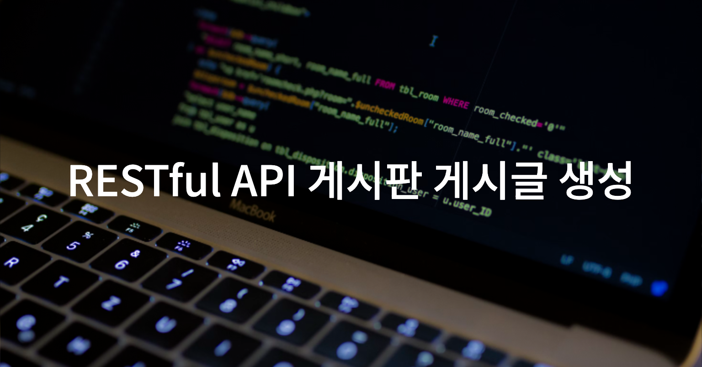

# 게시판 게시글 CRUD API 구현

## Entity(BoardPost)
- id(pk), title, content, createAt, updateAt 필드 생성
    ```java
    @Getter
    @Setter
    @NoArgsConstructor
    @AllArgsConstructor
    public class BoardPost {
        private Long id;
        private String title;
        private String content;
        private String author;
        private LocalDateTime createdAt;
        private LocalDateTime updatedAt;
    }
    ```

## DTO(BoardPostDto)
- id를 제외한 BoardPost 클래스의 필드 생성
    ```java
    @Getter
    @Setter
    @NoArgsConstructor
    @AllArgsConstructor
    public class BoardPostDto {
        private String title;
        private String content;
        private String author;
        private LocalDateTime createdAt;
        private LocalDateTime updatedAt;
    }
    ```

## Controller(BoardPostController)
- BoardPostController 클래스
    ```java
    @RequiredArgsConstructor
    @RestController
    @RequestMapping("/api/posts")
    public class BoardPostController {
        private final BoardPostService boardPostService;
    		// CRUD 데이터 접근 로직(DAO)
    }
    ```
- 게시글 생성 메서드(CREATE)
    ```java
    @PostMapping
    public ResponseEntity<BoardPostDto> createPost(@RequestBody BoardPostDto boardPostDto) {
        BoardPostDto boardPostDTO = boardPostService.createPost(boardPostDto);
        return ResponseEntity.status(HttpStatus.CREATED).body(boardPostDTO);
    }
    ```
- 게시글 조회 메서드(READ)
    ```java
    @GetMapping
    public ResponseEntity<List<BoardPostDto>> getPostsAll() {
    		List<BoardPostDto> boardPostDto = boardPostService.getPostsAll();
    		return ResponseEntity.ok(boardPostDto);
    }
    
        
    // 특정 id 게시글 조회
    @GetMapping("/{id}")
    public ResponseEntity<BoardPostDto> getPostById(@PathVariable Long id) {
    		BoardPostDto boardPostDto = boardPostService.getPostById(id);
        return ResponseEntity.ok(boardPostDto);
    }
    ```
- 게시글 수정 메서드(UPDATE)
    ```java
    @PutMapping("/{id}")
    public ResponseEntity<BoardPostDto> updatePost(@PathVariable Long id, @RequestBody BoardPostDto boardPostDto) {
        BoardPostDto boardPostDTO = boardPostService.updatePostById(id, boardPostDto);
        return ResponseEntity.status(HttpStatus.OK).body(boardPostDTO);
    }
    ```
- 게시글 삭제 메서드(DELETE)
    ```java
    @DeleteMapping("/{id}")
    public ResponseEntity<Void> deletePost(@PathVariable Long id) {
        boardPostService.deletePostById(id);
        return ResponseEntity.status(HttpStatus.NO_CONTENT).body(null);
    }
    ```


## Service(BoardPostService)
- BoardPostService 클래스
    ```java
    @Slf4j
    @Service
    public class BoardPostService {
    		// 생성된 BoardPost를 담을 메서드
        private List<BoardPost> boardPosts = new ArrayList<>();
        // BoardPosts의 id 값
        private Long nextPostId = 1L;
    }
    ```
- 생성된 게시글을 BoardPostDto 객체로 변환하여 반환하는 로직
    ```java
    // 생성된 BoardPost 객체를 BoardPost로 바꿔서 반환
    private static BoardPostDto convertToBoardPostDto(BoardPost boardPost) {
        BoardPostDto boardPostDto = new BoardPostDto();
        boardPostDto.setTitle(boardPost.getTitle());
        boardPostDto.setContent(boardPost.getContent());
        boardPostDto.setAuthor(boardPost.getAuthor());
        boardPostDto.setCreatedAt(boardPost.getCreatedAt());
        boardPostDto.setUpdatedAt(boardPost.getUpdatedAt());
        return boardPostDto;
    }
    ```
- BoardPostDto 객체를 BoardPost 엔티티로 변환하는 로직
    ```java
    private static BoardPost convertToBoardPostEntity(BoardPostDto boardPostDto) {
    		BoardPost boardPost = new BoardPost();
        boardPost.setTitle(boardPostDto.getTitle());
        boardPost.setContent(boardPostDto.getContent());
        boardPost.setAuthor(boardPostDto.getAuthor());
        boardPost.setCreatedAt(boardPostDto.getCreatedAt());
    
        return boardPost;
    }
    ```
- 게시글 생성 메서드
    ```java
    public BoardPostDto createPost(BoardPostDto boardPostDto){
    		log.info("게시글을 생성했습니다: {}", boardPostDto.getTitle())
    		BoardPost boardPost = convertToBoardPostEntity(boardPostDto);
    		boardPost.setId(nextPostId++);
    		boardPost.setCreatedAt(LocalDateTime.now());
        boardPosts.add(boardPost);
    		return convertToBoardPostDto(boardPost)
    }
    ```
- 게시글 조회 메서드
    ```java
    // 전체 게시글 조회
    public List<BoardPostDto> getPostsAll() {
        log.info("게시글 전체를 조회했습니다.");
        return boardPosts.stream()
                .map(BoardPostService::convertToBoardPostDto)
                .collect(Collectors.toList());
    }
    
    // 특정 게시글 조회
    public BoardPostDto getPostById(Long id) {
        log.info("{}번 게시글 조회",id);
        return boardPosts.stream()
               .filter(boardPost -> boardPost.getId().equals(id))
               .map(BoardPostService::convertToBoardPostDto)
               .findFirst()
               .orElseThrow(() -> new IllegalArgumentException("게시글이 없습니다."));
    }
    ```
- 게시글 찾기 메서드(이거로 삭제 및 업데이트 로직의 반복되는 코드를 줄임)
    ```java
    public BoardPost findPostById(Long id) {
        return boardPosts.stream()
                .filter(boardPost -> boardPost.getId().equals(id))
                .findFirst()
                .orElseThrow(() -> new IllegalArgumentException("게시글을 찾을 수 없습니다"));
    }
    ```
- 게시글 수정 메서드
    ```java
    // 게시글 수정 메서드
    public BoardPostDto updatePostById(Long id, BoardPostDto boardPostDto) {
        log.info("{}번 게시글을 변경했습니다 {}.",id,LocalDateTime.now());
        BoardPost boardPost = findPostById(id);
        boardPost.setTitle(boardPostDto.getTitle());
        boardPost.setContent(boardPostDto.getContent());
        boardPost.setAuthor(boardPostDto.getAuthor());
        boardPost.setUpdatedAt(LocalDateTime.now());
        return convertToBoardPostDto(boardPost);
    }
    ```
- 게시글 삭제 메서드
    ```java
    // 게시글 삭제 메서드
    public void deletePostById(Long id) {
        BoardPost boardPost = findPostById(id);
        boardPosts.remove(boardPost);
    }
    ```


## 결과

- 게시글 생성
  
- 게시글 전체 확인
  
- 특정 id 게시글 확인
  
- 게시글 수정
  
- 게시글 삭제 및 확인
  
  